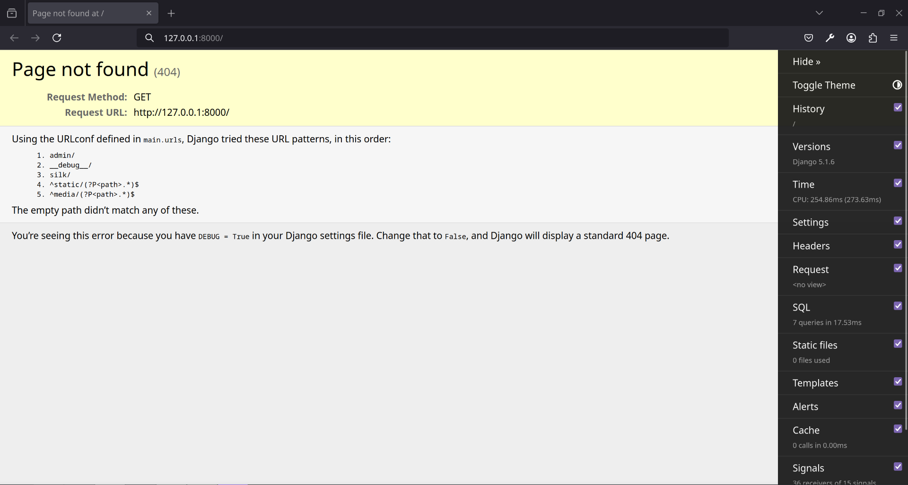
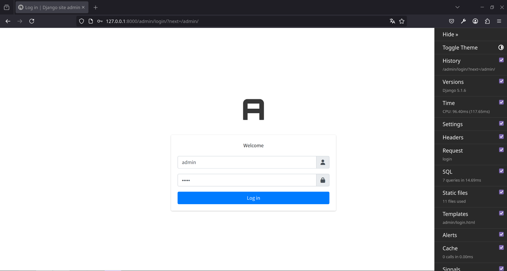
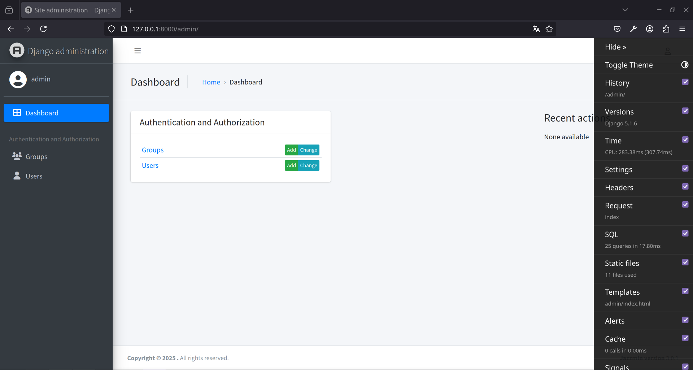
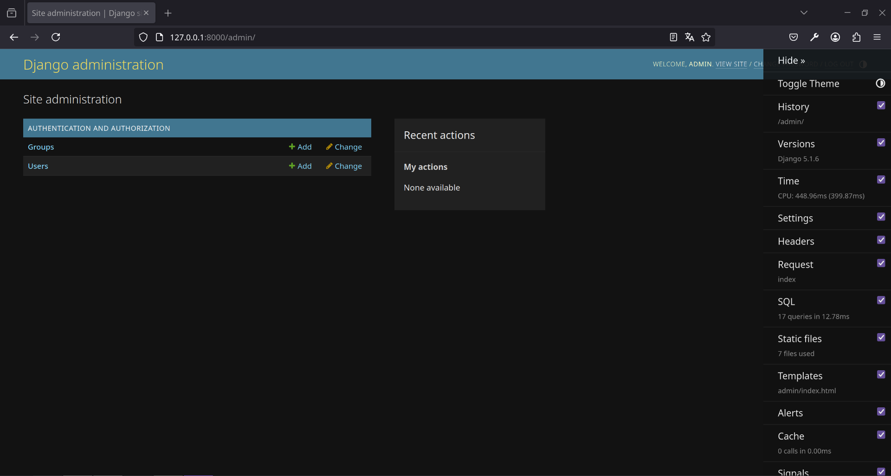
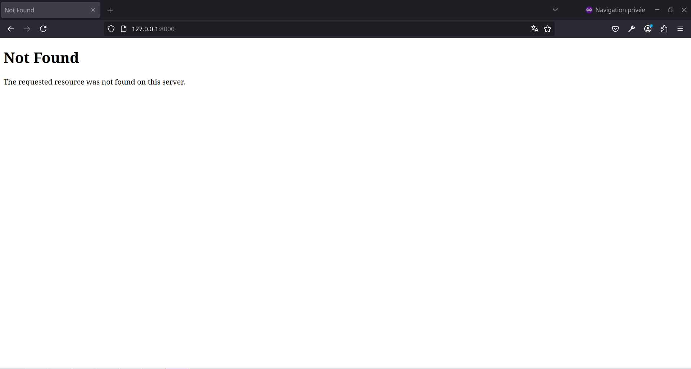

# Starter Django

Ce projet est un démarrage rapide pour une application Django configurée avec Jazzmin pour le panneau d'administration, ainsi que des outils de développement `django-debug-toolbar` et `django-silk`.
## Prérequis

Avant de commencer, assurez-vous d'avoir installé `pipenv`. Si ce n'est pas le cas, installez-le avec la commande suivante :

Python pip : 
```bash
pip install pipenv
```
Arch : 
```bash
sudo pacman -S python-pipenv
```
Ubuntu/Debian : 
```bash
sudo apt install pipenv
```
Python : 
```bash
sudo dnf install pipenv
```

## Pourquoi `pipenv` et pas juste `pip` avec un `venv` ?

`pipenv` est utilisé dans ce script car il offre une gestion plus avancée des dépendances par rapport à `pip`. Il permet notamment de séparer facilement les dépendances de développement avec le flag (`--dev`) des dépendances de production, ce qui facilite la gestion des environnements et des déploiements, puisqu'on n'a pas à trier dans le requirement.txt.


## Étapes d'installation

1. Téléchargez le script sur votre machine.

2. Ouvrez un terminal dans le répertoire de votre projet et exécutez la commande suivante pour créer un environnement virtuel avec `pipenv` et installer les dépendances :

    ```bash
    ./django-starter.sh
    ```

    Cela démarrera un projet Django configuré.

3. Une fois l'installation terminée, entrez dans l'environnement virtuel :

    ```bash
    pipenv shell
    ```

4. Lancez le serveur de développement Django :

    ```bash
    python manage.py runserver
    ```

## Vérification du projet

Une fois le serveur démarré, ouvrez votre navigateur à l'adresse suivante :

### 1. Page d'accueil (Erreur 404)

Accédez à [http://localhost:8000](http://localhost:8000). Vous devriez voir une erreur 404, ce qui est normal puisque l'URL de base n'est pas encore définie.

  
*Page d'accueil avec une erreur 404.*

### 2. Panneau d'administration

Accédez à [http://localhost:8000/admin](http://localhost:8000/admin) pour voir la page de connexion à l'administration Django.

  
*Page de connexion du panneau d'administration (identifiants par défaut : admin / admin).*

### 3. Panel d'administration Jazzmin

Une fois connecté avec les identifiants par défaut (`admin` / `admin`), vous serez redirigé vers le panneau d'administration configuré avec Jazzmin.

  
*Panneau d'administration avec Jazzmin.*

### 4. Panel d'administration classique

Sans Jazzmin ça rend beaucoup moins bien quand meme.

  
*Panneau d'administration Django classique.*

### 5. Erreur 404 avec `DEBUG=False`

Si vous définissez `DEBUG=False` dans le fichier `.env` et que vous essayez d'accéder à une page inexistante, vous recevrez une erreur 404 du navigateur.

  
*Page 404 classique avec `DEBUG=False`, On remarque également que la toolbar a disparue.*

## Configuration

Le script prépare le projet en effectuant les actions suivantes :

1. **Initialisation du projet Django** avec la commande `django-admin startproject`.
2. **Configuration de la base de données** dans `settings.py`, avec des valeurs par défaut pour SQLite, mais permettant de configurer PostgreSQL via le fichier `.env`.
3. **Ajout de Jazzmin** pour l'administration et `django-extensions` pour des outils supplémentaires.
4. **Ajout des outils de développement** comme `django-debug-toolbar` et `django-silk` pour la gestion des performances.
5. **Création d'un superutilisateur** avec les identifiants par défaut (`admin` / `admin`).
6. **Formatage** du code avec (`black`, `isort`).

## Fichiers importants

- `.env` : Contient les paramètres de configuration sensibles comme `SECRET_KEY`, `DEBUG`, et la configuration de la base de données.
- `.flake8` : Configure les règles de linting pour `flake8`.
- `pytest.ini` : Configure `pytest` pour tester l'application.
- `requirements.txt` : Liste des dépendances installées.